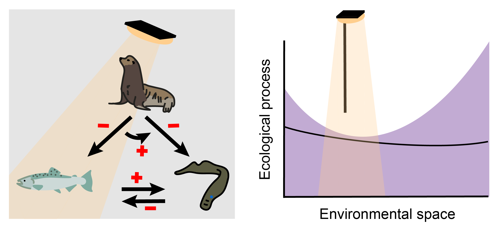

# Quantifying the cost of cultural bias in conservation decision-making



This repository contains code and data used to quantify the cost of cultural bias for a conservation decision maker in the context of management in the Columbia River Basin. This repository also contains the manuscript and supplemental information associated with the manuscript.

## File structure and contents

```
cultural_bias_decisions
│   README.md  
│
└───code
│   │ VOI.R # code for calculating the Value of Information (Equation 19)
│   │ get_posterior_sub.R # code for exploring posterior samples and generating a representative set to display in figures   
│   │ timeseries_functions.R # functions representing the stylized representation of the three-species dynamical system (Equations 1-7)
│   │
│   └─────MSFR
│         │ LPS_prop_nimble.R # code for generating posterior samples for the proportion of total lamprey observed in day-time visual counts (Equation 13)
│         │ MSFR_LPS_data.R # code for preparing observed lamprey counts from raw data files
│         │ MSFR_fit_nimble.R # code for generating posterior samples for the multi-species functional response (MSFR) (Equations 8-12, 14-18)
│         │ posterior_predictive_check.R # code for generating posterior predictive samples and calculating Bayesian p-values with the posterior generated in the primary analysis
│         └─────sensitivity
│               └─────passage
│                     │ MSFR_fit_nimble_4day.R # code for generating posterior samples for the multi-species functional response (MSFR) with a 4-day time window (Supporting Information, 1.2)
│                     │ MSFR_fit_nimble_5day.R # code for generating posterior samples for the multi-species functional response (MSFR) with a 5-day time window (Supporting Information, 1.2)
│               └─────prior
│                     │ MSFR_fit_n10_100.R # code for sensitivity analysis for the prior distribution of parameter b (b_log ~ Uniform(10, 100))
│                     │ MSFR_fit_n10_50.R # code for sensitivity analysis for the prior distribution of parameter b (b_log ~ Uniform(10, 50))
│   │
│   └─────figures # code for generating figures
│   
└───data
│   └─────Bonneville_dam_LPS # data from Bonneville dam Lamprey Passage Structures (LPS), retrieved from the Fish Passage Center database (https://www.fpc.org/webapps/adultsalmon/Q_adultcounts_lamprey_dataquery.php)
│   └─────Bonneville_dam_returns # data from Bonneville dam daytime visual counts, retrieved from the Columbia River DART database (https://www.cbr.washington.edu/dart/query/adult_graph_text)
│   └─────MSFR
│         │ BON_gastro_data.csv # raw sea lion gastro-intestinal data from MMPA-mandated reports
│   └─────model_data # data used to fit NIMBLE models (MSFR and lamprey day-time proportion)
│   │
│   │ DART_smolt_adult_return.csv # smolt-adult return estimates (i.e., ocean survival), retrieved from the DART database (https://www.cbr.washington.edu/dart/query/pit_sar_esu)
│   │ WargoRub_estuary_mortality.csv # Chinook salmon estuary survival rates estimated by Wargo Rub et al., 2019 (dx.doi.org/10.1139/cjfas-2018-0290)
│   │ ppp.rds # table of posterior predictive p-values 
│
└───figures # figure files
│   └─────supplemental # supplemental figure files
│
└───manuscript
│   │ lamprey_refs.bib # bibliography file
│   │ main.pdf # pdf of main manuscript text
│   │ main.tex # latex file of main manuscript text
│   │ supporting_information.Rmd # Rmarkdown of supporting information
│   │ supporting_information.pdf # pdf of supporting information
│
└───posterior_samples
│   │ LPS_posterior.rds # posterior samples for the proportion of total lamprey observed in day-time visual counts (Equation 13)
│   │ MSFR_posterior.rds # posterior samples for the multi-species functional response (MSFR) (Equations 8-12, 14-18)
│   │ index_sub.rds # indices of representative set of posterior samples to display in figures
│   └─────sensitivity
│         └─────passage
│               │ MSFR_posterior_4day.rds # posterior samples for the multi-species functional response (MSFR) with a 4-day time window (Supporting Information, 1.2)
│               │ MSFR_posterior_5day.rds # posterior samples for the multi-species functional response (MSFR) with a 5-day time window (Supporting Information, 1.2)
│         └─────prior
│               │ MSFR_blog_unif_n10_100.R # posterior samples for sensitivity analysis with the prior distribution of parameter b (b_log ~ Uniform(10, 100))
│               │ MSFR_blog_unif_n10_50.R # posterior samples for sensitivity analysis with the prior distribution of parameter b (b_log ~ Uniform(10, 50))

```

## Bayesian implementation

The multi-species functional response (MSFR) model is specified using NIMBLE (download instructions given here: <https://r-nimble.org/download>), which adopts and extends BUGS as a Bayesian modeling language. We also use the Markov chain Monte Carlo algorithms written in the NIMBLE software to generate posterior samples, and use the NIMBLE model object to generate posterior predictive samples as part of our model checking procedure.