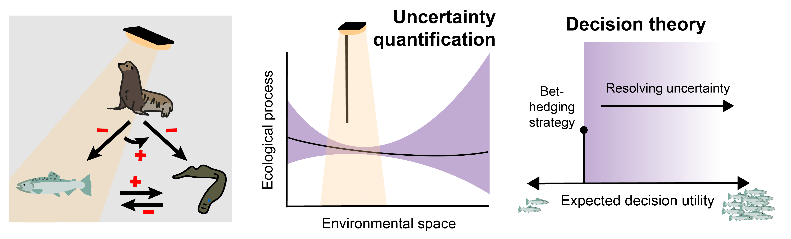

# Quantifying the cost of cultural bias in conservation decision-making

This repository contains code and data used to quantify the cost of
cultural bias for a conservation decision maker in the context of
management in the Columbia River Basin. This repository also contains
the manuscript and supplemental information associated with the
manuscript.
