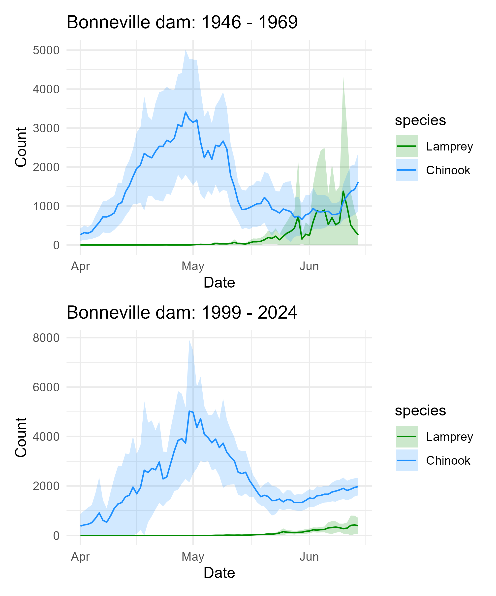
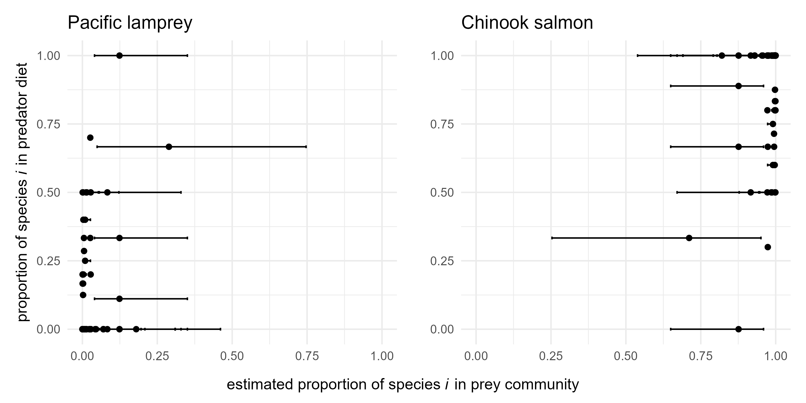
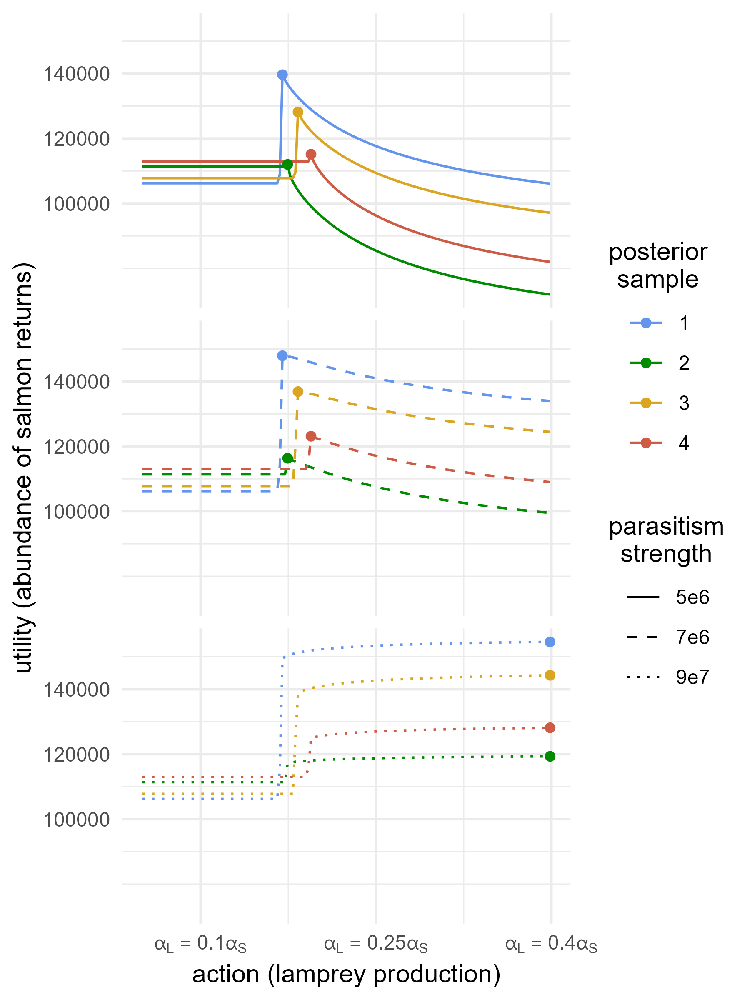
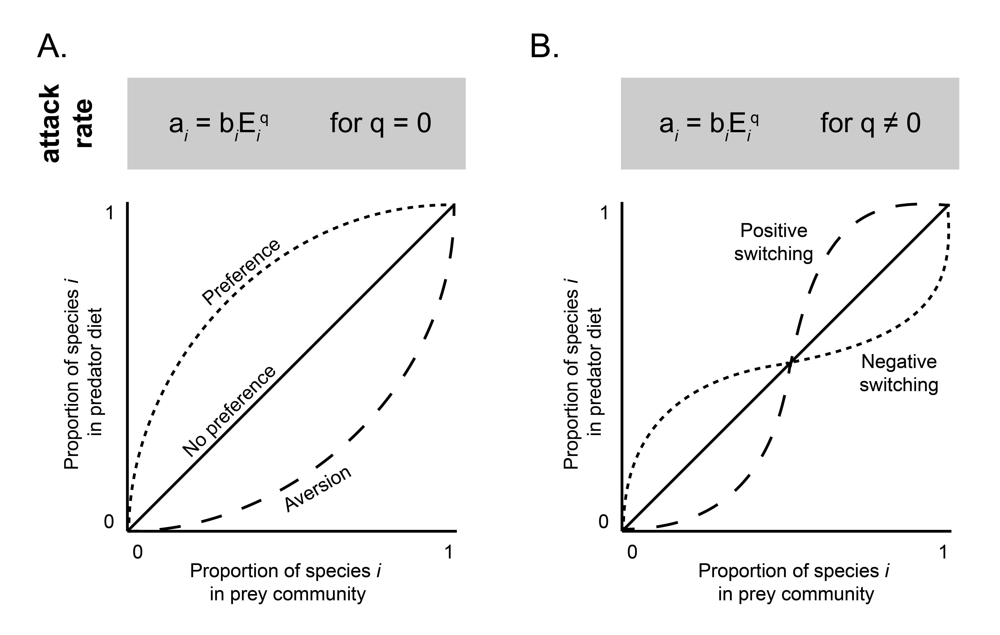
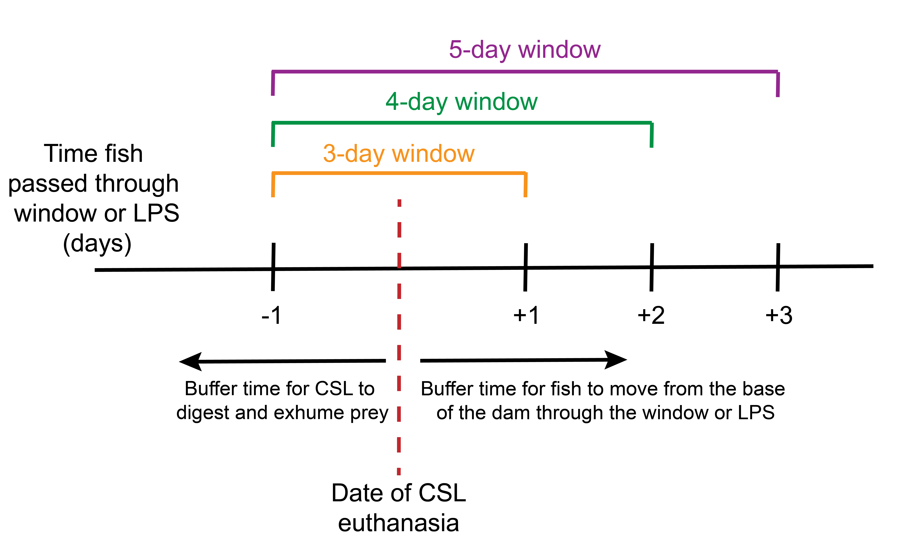

```{r, echo = FALSE, warning = FALSE, message = FALSE}
library(tidyverse)
library(dplyr)
library(patchwork)
library(bayestestR)
library(MCMCvis)
library(kableExtra)
```

This PDF file includes:

>Supporting text ...... 2

>Tables S1 to S7 ...... 8

>Figures S1 to S12 ... 30

>SI References ....... 40

\newpage

# Supporting Information Text

## Multi-species functional response (MSFR) model

### MSFR model prior distributions

Below are the vague prior distributions used for MSFR model parameters.

Handling time of species $i$:

$$
h_i \sim \text{Uniform}(0, 1000)
$$

Log-scale attack rate for species $i$:

$$
\text{log}(b_i) \sim \text{Uniform}(-100, 100)
$$

MSFR exponent:

$$
q \sim \text{Uniform}(-2, 2)
$$

Abundance of available Pacific lamprey at time $t$:

$$
L_t^A \sim \text{Uniform}(0, 1000000)
$$

Abundance of available Chinook salmon at time $t$:

$$
S_t^A \sim \text{Uniform}(0, 1000000)
$$

Beta distribution shape parameters informing the lamprey probability of detection in visual fish ladder surveys:

$$
\alpha^D \sim \text{Uniform}(0, 100)
$$
$$
\beta^D \sim \text{Uniform}(0, 100)
$$


\newpage

### MSFR data sources

Here we outline the data sources used to fit the multi-species functional response model (MSFR, Equations 8-18). The model uses two sources of data: 1) gastro-intestinal consumption data from 107 euthanized California sea lions (CSL) and 2) Bonneville dam passage data from day-time visual counts in fish ladders, night-time visual counts in fish ladders, and mechanical counts in lamprey passage structures (LPS). The dam passage data is used to inform both 1) the observed abundance of fish passed, $L^P_t$ and $S^P_t$, during the time window, $t$ surrounding CSL euthanasia and 2) the probability of lamprey detection in day-time visual counts in fish ladders. 

To estimate CSL consumption rates, we use data on prey items recovered in the gastro-intestinal tracks of 107 California sea lions euthanized below Bonneville dam in 2017-2019 and 2021-2023 (Table S3, Table S6). This diet analysis is based on the identification of undigested prey remains from the stomachs and large intestines of euthanized CSLs following the procedures in Lance et al. (2001), where prey were enumerated by examining all structures (otoliths, tail structures, cephalopod beaks, etc.) to determine the minimum number of individual prey items in the sample [@lance2001pinniped]. These data were retrieved from annual reports to the National Marine Fisheries Service (NMFS) documenting compliance with the terms and conditions of the authorization for lethal removal of California sea lions under the Marine Mammal Protection Act [@clark2021pinniped; @edwards2022columbia; @clark2023columbia]. 

While above-surface pinniped predation events are monitored at Bonneville dam and have previously been used to estimate the CSL functional response for salmonid prey [@hatch2018sealion], these above-surface data likely underestimate lamprey predation, as lamprey predation typically occurs below surface [@tidwell2023pinniped]. We therefore use the gastro-intestinal data to reduce differences in consumption observation error between fish species. We subset the prey item data to those identified as adult Chinook salmon and Pacific lamprey, and we assume the prey items represent consumption in the 24 hours before euthanasia, as this is the time typically taken for CSL prey to pass through the digestive system (Tidwell, personal communication).

To estimate the abundance of the prey available to CSL during the period of consumption, $L_t^A$ and $S_t^A$, we use fish passage data from Bonneville dam. For Chinook salmon, these data include daily, visual daytime counts across all Bonneville dam fish ladders, retrieved from the Columbia River DART database. For Pacific lamprey, however, these visual daytime counts in the fish ladders underestimate abundance, as 1) Pacific lamprey also use Lamprey Passage Structures (LPS) in addition to the fish ladders and 2) lamprey tend to migrate at night, rather than during the day [@cates2020lamprey] (Figure 2). In 2017 and 2019, mechanical counts of Pacific lamprey in five LPS and visual nighttime counts in the fish ladders were recorded and available through the Fish Passage Center database. We use these data to estimate the probability of detecting lamprey during daytime visual counts in the remaining years (2018, 2021-2023) (Table S4).

The observed number of salmon and lamprey passing through the dam, $S_t^P$ and $L_t^P$ respectively, is paired with the time point $t$ of California sea lion (CSL) euthanasia. To pair these data, we take the sum of fish passing through the dam during a time window surrounding the date of euthanasia, $t$. This time window accounts for a time lag in both 1) the passage of fish remains through the body of the California sea lion (CSL) and 2) movement of fish from the entrance of the dam as prey to their moment of observation through the fish windows or lamprey passage structures (LPS) (See "Dam count data sensitivity analysis" below, Figure S11).

For our main analysis, we chose a three-day time window to calculate $S_t^P$ and $L_t^P$ (one day before the date of CSL euthanasia to one day following the date of CSL euthanasia). To assess the sensitivity of our results to the selection of this time window, we conducted a sensitivity analysis with a four-day time window (one day before the date of CSL euthanasia to two days following the date of euthanasia) and a five-day time window (one day before the date of CSL euthanasia to three days following the date of euthanasia) (Table S6).

### MSFR model code

Below is the NIMBLE model code for MSFR model (Equations 8-12, 14-18) and for estimating the lamprey probability of detection by visual counts at Bonneville fish ladders (Equation 13).

```{r, eval = FALSE}

##############
# MSFR model #
##############

MSFR_model <- nimbleCode({
  
  ###############################
  # Chinook salmon prey abundance
  
  for (t in 1:n_time) {
    
    # Equation 8
    # get expected number of salmon passed
    S[t] ~ dpois(S_P[t])
    
    # Equation 9
    # get expected number of salmon available
    S_P[t] ~ dbinom(size = round(S_A[t] - F_day[t, 2]), 
                    prob = salmon_PE)
  }
  
  ########################
  # Lamprey prey abundance
  
  # Equation 10
  # get expected number of available lamprey passed - exact years
  for (t in 1:n_exact) {
    L_exact[t] ~ dpois(L_P[t_exact[t]])
  }
  
  # get expected number of available lamprey passed - inexact years
  for (t in 1:n_inexact) {
    # Equation 11
    L_inexact[t] ~ dbinom(size = L_P[t_inexact[t]], 
                          prob = p_D[t])
    # Equation 12
    p_D[t] ~ dbeta(alpha_D, beta_D)
  }
  
  for (t in 1:n_time) {
    # Equation 14
    # get expected number of lamprey available 
    L_P[t] ~ dbinom(size = round(L_A[t] - F_day[t, 1]), 
                    prob = lamprey_PE)
  }
  
  ###############
  # Consumed prey
  
  # number of prey consumed
  for (j in 1:n_obs) {
    
    for (i in 1:n_species) {
      
      # Equations 15-16
      consumed[j, i] ~ dpois(F_exp[obs_ref[j], i]) 
      
    }
  }
  
  ###################################
  # Multi-species functional response
  
  for (t in 1:n_time) {
    
    # Equations 17-18
    # expected number of prey consumed - function of available fish
    F_exp[t, 1:n_species] <- get_MSFR(L_A[t] / N_scale, 
                                      S_A[t] / N_scale, 
                                      q, h[1:n_species], 
                                      b_log[1:n_species])
  }
  
  
  ##########
  # priors #
  ##########
  
  # MSFR params
  for (i in 1:n_species) {
    h[i] ~ dunif(0, 1000) # handling time
    b_log[i] ~ dunif(-100, 100) # attack rate
  }
  
  q ~ dunif(-2, 2)
  
  # total expected number of lamprey and salmon available
  for (t in 1:n_time) {
    L_A[t] ~ dunif(0, 1000000)
    S_A[t] ~ dunif(0, 1000000)
  }
  
})

# MSFR
get_MSFR <- nimbleFunction (
  # input and output types
  run = function(L = double(0), S = double(0), 
                 q = double(0), h = double(1),
                 b_log = double(1))
  {
    returnType(double(1))
    
    # combine abundance into one vector
    x <- c(L, S)
    
    # calculate the denominator
    denominator <- 1 + (exp(b_log) * h) %*% x ^ (1 + q)
    
    L_prey <- exp(b_log[1]) * L ^ (1 + q) / denominator
    
    S_prey <- exp(b_log[2]) * S ^ (1 + q) / denominator
    
    return(c(L_prey, S_prey))
  }
)
assign("get_MSFR", get_MSFR, envir = .GlobalEnv)
```


```{r, eval = FALSE}
############################
# probability of detection #
############################

# calculate proportion
LPS_prop <- C_V / C_T

LPS_model <- nimbleCode({
  
  alpha_D ~ dunif(0, 100)
  beta_D ~ dunif(0, 100)
  
  for (i in 1:nprop) {
    LPS_prop[i] ~ dbeta(alpha_D, beta_D)
  }
  
})
```

### MSFR model fitting

We fit the MSFR model in a Bayesian framework using NIMBLE v.1.3.0 [@de2017programming]. To enable convergence, the model was fit sequentially, where the beta distribution shape parameters, $\alpha^D$ and $\beta^D$, informing the probability of lamprey detection in daytime visual counts, $p^D$, (Equation 13) were fit first using data, $C_d^V$ and $C_d^T$. The median posterior values for $\alpha^D$ and $\beta^D$ were then used to fit the rest of the MSFR model.

For MSFR model fitting, available prey abundance, $S^A_t$ and $L^A_t$, was rescaled by a factor of 10000 so that abundance would range from 0 to ~1 to assist numerical performance and convergence [@ransijn2021integrating]. We used vague priors for all parameters, which are provided in Appendix 2.1. Parameters were estimated by running four Markov chain Monte Carlo (MCMC) chains of 50 000 000 iterations, thinned by a factor of 10 000. Of these 5 000 samples, 200 were discarded as burn-in. We used visual inspection of the MCMC chains and the Brooks and Gelman diagnostic $\hat{R}$ to assess model convergence, and we found that all parameters had an $\hat{R} \leq 1.1$ [@brooks1998general]. All analyses were conducted in R version 4.5.1 [@Rcore]. Posterior summaries, as well as convergence diagnostics and trace plots of model parameters can be found in Table S2 and Figure S2. 

\newpage

## Dam count data sensitivity analysis

The observed number of salmon and lamprey passing through the dam, $S_t^P$ and $L_t^P$ respectively, is paired with the time point $t$ of California sea lion (CSL) euthanasia. To pair these data, we take the sum of fish passing through the dam during a time window surrounding the date of euthanasia, $t$. This time window accounts for a time lag in both 1) the passage of fish remains through the body of the California sea lion (CSL) and 2) movement of fish from the entrance of the dam as prey to their moment of observation through the fish windows or lamprey passage structures (LPS).

For our main analysis, we chose a three-day time window to calculate $S_t^P$ and $L_t^P$ (one day before the date of CSL euthanasia to one day following the date of CSL euthanasia). To assess the sensitivity of our results to the selection of this time window, we conducted a sensitivity analysis with a four-day time window (one day before the date of CSL euthanasia to two days following the date of euthanasia) and a five-day time window (one day before the date of CSL euthanasia to three days following the date of euthanasia) (Figure S11).

We fit the same Bayesian multi-species functional response (MSFR) model described in Equations 8-12, 14-18 where the number of salmon and lamprey passing through the dam, $S_t^P$ and $L_t^P$, respectively, were calculated using the four-day and five-day time windows. We then compared the results of our main analysis (3-day time window) to the results with the four- and five-day time window by comparing the 1) MSFR parameter estimates (Table S7) and 2) MSFR model predictions calculated with the posterior samples (Figure S12).

With these results taken together, we conclude that although some parameter estimates change slightly (Table S7), the selection of time window has a negligible effect on the the MSFR model predictions.

\newpage

# Tables

```{r, echo = FALSE, warning = FALSE, message = FALSE}
params <- data.frame(
  name = c("$b_i$", "q", "$h_i$", "$\\alpha_L$", "$\\alpha_S$",
           "$K_S$", "$K_L$", "$D_S$", "$D_L$", "$s^o$", "P"),
  description = c(paste0("Density-dependent attack rate coefficient for prey ",
                         "species $i$"),
                  "Multi-species functional response exponent",
                  "Handling time for prey species $i$",
                  paste0("Lamprey production parameter (combines freshwater ",
                         "mortality and population intrinsic rate of growth)"),
                  paste0("Salmon production parameter (combines freshwater ",
                         "mortality and population intrinsic rate of growth)"),
                  "Lamprey carrying capacity", 
                  "Salmon carrying capacity", 
                  paste0("Coefficient scaling the rate at which salmon ",
                         "survival decreases as a function of lamprey density"),
                  paste0("Coefficient scaling the rate at which lamprey ",
                         "survival increases as a function of salmon density"),
                  paste0("Density-independent ocean survival, shared between ",
                         "both species"),
                  paste0("Expected number of California sea lion estuary days ",
                         "(i.e., daily abundance in estuary x days)")),
  value = c("*", "*", "*", "*", 225, "3e6", "3e6", 
            "9e7, 7e6, 5e6", "5e-5", 0.0602, 10000),
  source = c(1, 1, 1, 2, 3, 3, 3, 4, 5, 6, 7)
)
colnames(params) <- c("parameter\nsymbol", "description", 
                      "parameter\nvalue", "source")
```

**Table S1.** Summary of parameters used in dynamical model. The asterisk indicates that the parameter takes on many values.
```{r, echo = FALSE}
# Render table
knitr::kable(
  params,
  escape = FALSE,
  format = "latex",
  booktabs = TRUE,
  longtable = TRUE
) %>%
  kable_styling(latex_options = "hold_position") %>%
  column_spec(2, width = "8cm") 
```


> $\textsuperscript{1}$ Parameter is estimated with data using the Bayesian multi-species functional response statistical model (Equations 8-18).

> $\textsuperscript{2}$ Parameter is treated as the decision maker's action, and therefore takes on many values.

> $\textsuperscript{3}$ The salmon production parameter and carrying capacity are chosen such that the equilibrium salmon abundance at low lamprey production (~120,000, Figure 4A) is similar to the observed mean abundance of salmon entering Bonneville dam (Figure S8). Lamprey carrying capacity is chosen to be equal to salmon carrying capacity.

> $\textsuperscript{4}$ Research on the adult Pacific lamprey parasitic phase remains sparse, with little consensus on the relationship between Pacific lamprey abundance and survival of Pacific salmon in their marine phase. Pacific salmon are well-documented hosts of Pacific lampreys, evidenced by observations of Pacific lampreys in catch and inflicted wounds on hosts [@beamish1980adult]. Murauskas et al. 2013 found a statistically significant relationship between marine abundance indicators of Chinook salmon and Pacific lamprey adult returns to the Columbia River, concluding that abundance of host species is the leading contributor Pacific lamprey ocean survival, characteristic of a predator-prey relationship [@murauskas2013relationships]. The authors suggest that Pacific lampreys may be an overlooked and substantial predator of marine fish, yet the magnitude of this predation is not quantified. Additionally, Weitkamp et al. 2015 examined host selection of multiple lamprey species in the Columbia River estuary, and while around 1% of Chinook salmon exhibited lamprey wounds, these wounds were attributed to River lamprey, rather than Pacific lamprey [@weitkamp2015seasonal]. These results, however, may reflect the behavior of Pacific lamprey as they migrate through the estuary, rather than their behavior in the ocean.

> To reflect uncertainty in the magnitude of Pacific lamprey predation on Chinook salmon, we choose parameter values for $D_S$ that range from no impact on Chinook salmon ocean survival ($D_S = 9e7$, Figure 2) to a relatively high impact on Chinook salmon ocean survival that decreases ocean survival by 2% at high lamprey abundance ($D_S = 3e6$, Figure 2).

> $\textsuperscript{5}$ Murauskas et al. 2013 found that the abundance of host species is the leading contributor Pacific lamprey ocean survival. The parameter value for $D_L$ is chosen to reflect a scenario where lamprey survival increases rapidly as a function of salmon density (Figure S9) [@murauskas2013relationships].

> $\textsuperscript{6}$ The parameter value is chosen based on two sources: 1) the Columbia River Chinook salmon smolt-to-adult ratio in Bonneville dam from the DART database and 2) the survival rate of adult spring-run Chinook salmon from the mouth of the Columbia River estuary to Bonneville dam, estimated using passive integrated transponder tags [@wargo2019changes] (Figure S10). The smolt-to-adult ratio, $R^\text{SAR}$, measures the proportion of salmon smolts that returned to Bonneville dam. This ratio is the product of the mortality rate in the ocean (from exiting dam as a smolt to entering the Columbia River as an adult, $s^o$) and the mortality rate in the estuary (from entering the Columbia River as an adult to entering Bonneville dam, $s^e$): $R^\text{SAR} = s^o \times s^e$. To isolate just the mortality rate in the ocean, we divide the mean $R^\text{SAR}$ across years 2003 - 2024 by the mortality rate in the estuary estimated by Wargo Rub et al., 2019 in years 2010 - 2015 (Figure S10). The value for $s^o$ is shared between salmon and lamprey, as their ocean survival is documented to be highly correlated due to shared environmental conditions [@murauskas2013relationships].

> $\textsuperscript{7}$ While the abundance of California sea lions in the Columbia River varies from year to year, we inform $P$, the annual CSL abundance in the Columbia River estuary (daily abundance $\times$ number of days), using estimates of CSL abundance made by Hatch et al. 2018 (Figure 5 in report). The authors estimated abundance based on boat surveys across four zones from the mouth of the Columbia River to Bonneville dam each week from the beginning of March to mid-May [@hatch2018sealion]. We use a conservative estimate of $P = 10000$ lower than the estimated CSL abundance, recognizing that the CSL prey attack rate estimated in our analysis using the diet of CSLs euthanized at Bonneville dam is likely higher than other locations in the estuary, as the fish are easier to attack at they enter the dam passage structures.

\newpage


```{r, echo = FALSE, results = "hide"}
# create functions
create_traceplot <- function(out, param, names_df,
                             exp = FALSE) {
  name <- names_df$real_names[which(names_df$short_names == param)]
  
  if (exp) {
    plot <- ggplot() +
    geom_line(aes(x = 1:length(exp(out[[1]][, param])),
                  y = exp(out[[1]][, param])),
              color = "pink") +
    geom_line(aes(x = 1:length(exp(out[[2]][, param])),
                  y = exp(out[[2]][, param])),
              color = "purple") +
    geom_line(aes(x = 1:length(exp(out[[3]][, param])),
                  y = exp(out[[3]][, param])),
              color = "blue") +
    geom_line(aes(x = 1:length(exp(out[[4]][, param])),
                  y = exp(out[[4]][, param])),
              color = "red") +
    #scale_x_continuous(breaks = c(2000, 6000, 10000)) +
    labs(x = "iteration", y = "value") +
    ggtitle(parse(text = name)) +
    theme_minimal() +
    theme(plot.title = element_text(hjust = 0.5))
    
  } else {
    plot <- ggplot() +
    geom_line(aes(x = 1:length(out[[1]][, param]),
                  y = out[[1]][, param]),
              color = "pink") +
    geom_line(aes(x = 1:length(out[[2]][, param]),
                  y = out[[2]][, param]),
              color = "purple") +
    geom_line(aes(x = 1:length(out[[3]][, param]),
                  y = out[[3]][, param]),
              color = "blue") +
    geom_line(aes(x = 1:length(out[[4]][, param]),
                  y = out[[4]][, param]),
              color = "red") +
    #scale_x_continuous(breaks = c(2000, 6000, 10000)) +
    labs(x = "iteration", y = "value") +
    ggtitle(parse(text = name)) +
    theme_minimal() +
    theme(plot.title = element_text(hjust = 0.5))
  }
  
  return(plot)
}
```

```{r, echo = FALSE, results = "hide"}
# read in samples
out <- readRDS("../posterior_samples/MSFR_posterior_1day.rds")
```

```{r, echo = FALSE, results = "hide"}
# create df with param names
short_names <- c("b_log[1]", "b_log[2]", "h[1]", "h[2]", "q", 
                 colnames(out[[1]])[1:46], colnames(out[[1]])[93:138])

real_names <- c("b[L]", "b[S]", "h[L]", "h[S]", "q",
                paste0("L[", 1:46, "]^A"), paste0("S[", 1:46, "]^A"))

latex_names <- c("b_L", "b_S", "h_L", "h_S", "q",
                paste0("L^A_{", seq_len(46), "}"), 
                paste0("S^A_{", seq_len(46), "}"))

names_df <- as.data.frame(cbind(short_names, real_names, latex_names))
colnames(names_df) <- c("short_names", "real_names", "latex_names")
```

```{r, echo = FALSE, results = "hide"}
exp_ <- c(TRUE, TRUE, FALSE, FALSE, FALSE)
plots <- create_traceplot(out, short_names[1], names_df, exp = exp_[1])

for (i in 2:length(exp_)) {
  new_plot <- create_traceplot(out, short_names[i], names_df, exp = exp_[i])
  plots <- plots + new_plot
}
plots <- plots + plot_layout(ncol = 2)
```

```{r, echo = FALSE}
# get one matrix of posterior
out_df <- rbind(out[[1]], out[[2]], out[[3]], out[[4]])

# get mean, sd, Rhat, effective sample size
posterior <- MCMCsummary(out)[, c("mean", "sd", "Rhat", "n.eff")]
posterior$short_names <- rownames(posterior)

# subset
posterior <- posterior[posterior$short_names %in% short_names, ]

# get 95% credibility interval
posterior$lower_ci <- NA
posterior$upper_ci <- NA
for (i in seq_len(nrow(posterior))) {
  sub <- out_df[, which(colnames(out_df) == posterior[i, "short_names"])]
  posterior[i, "lower_ci"] <- as.numeric(hdi(sub, 0.95)[2])
  posterior[i, "upper_ci"] <- as.numeric(hdi(sub, 0.95)[3])
}

# round
for (i in seq_len(nrow(posterior))) {
  
  dig <- 3 - floor(log10(abs(posterior[i, "mean"])))
  
  posterior[i, "mean"] <- round(posterior[i, "mean"], digits = dig)
  posterior[i, "sd"] <- round(posterior[i, "sd"], digits = dig)
  posterior[i, "lower_ci"] <- round(posterior[i, "lower_ci"], digits = dig)
  posterior[i, "upper_ci"] <- round(posterior[i, "upper_ci"], digits = dig)
}

posterior$mean <- as.character(posterior$mean)
posterior$sd <- as.character(posterior$sd)
posterior$lower_ci <- as.character(posterior$lower_ci)
posterior$upper_ci <- as.character(posterior$upper_ci)

# add real names
posterior <- left_join(names_df, posterior, by = "short_names")

# function for getting 95% credibility interval
get_ci <- function(lower, upper) {
  out <- paste0("(", lower, ", ", upper, ")")
  return(out)
}

# get final df
posterior_final <- posterior[, c("latex_names", "mean", "sd")]
posterior_final[, "95 CI"] <- mapply(get_ci,
                                     posterior$lower_ci,
                                     posterior$upper_ci)
posterior_final[, "Rhat"] <- posterior$Rhat
posterior_final[, "ESS"] <- posterior$n.eff
colnames(posterior_final) <- c("parameter", "mean", "sd",
                               "95 CI", "Rhat", "ESS")
```

**Table S2.** Posterior summaries of the estimated parameters in the multi-species functional response (MSFR) model. Summaries including the mean, standard deviation, 95% credibility interval (highest density interval), $\hat{R}$, and effective sample size for the MSFR parameters and estimates of available prey, $A_t = \{L_t^A, S_t^A\}$ (Equations 17-18). Trace plots of posterior samples can be found in Figure S2.

```{r, echo = FALSE}
# Process the table for parsed text
posterior_final <- posterior_final %>%
  mutate(parameter = paste0("$", parameter, "$"))

# Render table
knitr::kable(
  posterior_final,
  escape = FALSE,
  format = "latex",
  booktabs = TRUE,
  longtable = TRUE
) %>%
  kable_styling(full_width = FALSE, latex_options = c("repeat_header")) %>%
  kableExtra::row_spec(-1,
                       extra_latex_after = "\\renewcommand{\\arraystretch}{2}")
```
\newpage

```{r, echo = FALSE, message = FALSE, warning=FALSE}
# read in data
gastro_CSL <- readRDS("../data/model_data/gastro_data.rds")

# sort by date
gastro_CSL <- gastro_CSL[order(as.Date(gastro_CSL$Date, format = "%d/%m/%Y")), ]

# add unique dates to gastro data
gastro_CSL <- gastro_CSL %>% 
  group_by(Date, d_unq) %>% 
  summarise(n = n())

final_df <- gastro_CSL[, c(2, 1, 3)]
colnames(final_df) <- c("t", "date", "N")
```


**Table S3.** Dates of California sea lion euthanasia and gastro-intestinal analysis. The date, $t$, corresponds to $t$ in the above Table S2, and $N$ corresponds to the number of euthanized CSL individuals at time $t$.

```{r, echo = FALSE}
# Render table
knitr::kable(
  final_df,
  escape = FALSE,
  format = "latex",
  booktabs = TRUE,
  longtable = TRUE
)
```

```{r, echo = FALSE}
# read in gastrointestinal data
gastro_CSL <- readRDS("../data/model_data/gastro_data.rds")

# read in unique dates
dates_df <- readRDS("../data/model_data/unique_dates.rds")

# add time window to unique dates
dates_df <- dates_df %>% 
  mutate(start = Date - 1,
         end = Date + 1)

# add start and end dates to gastro data
gastro_CSL <- left_join(gastro_CSL, dates_df, by = c("Date", "d_unq", "Year"))

final_gastro <- gastro_CSL[, c("Date", "Chinook", "Lamprey", "start", "end")]
colnames(final_gastro) <- c("Euthanasia date", "Chinook consumed ($F^S$)",
                            "Lamprey consumed ($F^L$)", "Time window start",
                            "Time window end")

```

\newpage

```{r, echo = FALSE}
############
# LPS data #
############

file_list_LPS <- c(
  "../data/Bonneville_dam_LPS/WA_AWS_2017.csv",
  "../data/Bonneville_dam_LPS/WA_AWS_2019.csv",
  "../data/Bonneville_dam_LPS/BI_AWS_2017.csv",
  "../data/Bonneville_dam_LPS/BI_AWS_2019.csv",
  "../data/Bonneville_dam_LPS/CI_ENT_2017.csv",
  "../data/Bonneville_dam_LPS/CI_ENT_2019.csv",
  "../data/Bonneville_dam_LPS/BradfordIsland_2017.csv",
  "../data/Bonneville_dam_LPS/BradfordIsland_2019.csv",
  "../data/Bonneville_dam_LPS/WashingtonShore_2017.csv",
  "../data/Bonneville_dam_LPS/WashingtonShore_2019.csv"
)

# read all CSV files into a combined df
combined_data_LPS <- do.call(rbind, lapply(file_list_LPS, read.csv))

# convert date columns
combined_data_LPS$CountDate <- as.Date(combined_data_LPS$CountDate, 
                                       format = "%m/%d/%Y")

# add day and month columns
combined_data_LPS$Day <- format(combined_data_LPS$CountDate, "%d")
combined_data_LPS$Day <- as.numeric(combined_data_LPS$Day)
combined_data_LPS$Month <- format(combined_data_LPS$CountDate, "%m")
combined_data_LPS$Month <- as.numeric(combined_data_LPS$Month)

combined_data_mech <- combined_data_LPS %>% 
  filter(Location %in% c("WA AWS LPS Mech", "BI AWS LPS Mech",
                         "Cascades Island AWS Traps"))
combined_data_window <- combined_data_LPS %>% 
  filter(Location %in% c("Bonneville Bradford Island",
                         "Bonneville Washington Shore"))

combined_data_mech <- combined_data_mech[, c("Location", "CountDate", 
                                             "LPSLamprey")] 

combined_data_window <- combined_data_window %>% 
  select(Location, CountDate, dayCount, nightCount) %>% 
  pivot_longer(cols = -c(Location, CountDate),
               values_to = "count",
               names_to = "type") %>% 
  mutate(Location = paste0(Location, ", ", type)) %>% 
  select(-type)
combined_data_window <- combined_data_window[, c("Location", "CountDate",
                                                 "count")]

colnames(combined_data_window) <- c("Location", "Date", "Count")
colnames(combined_data_mech) <- c("Location", "Date", "Count")

combined_data_all <- rbind(combined_data_window, combined_data_mech) %>% 
  pivot_wider(id_cols = c(Date),
              values_from = Count,
              names_from = Location)

# rename columns
colnames(combined_data_all)[2:8] <- c("bi_aws", "bi_day", "bi_night",
                                      "ws_day", "ws_night", "ci_aws",
                                      "wa_lps")

# sum
combined_lps_final <- combined_data_all %>% 
  mutate(day = bi_day + ws_day,
         night = bi_night + ws_night,
         lps = bi_aws + ci_aws + wa_lps)
```

```{r, echo = FALSE}
# read in gastrointestinal data
gastro_CSL <- readRDS("../data/model_data/gastro_data.rds")

# read in bonneville dam visual count data
bonneville <- readRDS("../data/model_data/bonneville_visualcount.rds")

# read in unique dates
dates_df <- readRDS("../data/model_data/unique_dates.rds")

# add time window to unique dates
dates_df <- dates_df %>% 
  mutate(start = Date - 1,
         end = Date + 1)

###############################################################
# calculate passed fish, L^P_T and S^P_t based on time window #
###############################################################

# add passage data to gastro data
for (i in 1:nrow(dates_df)) {
  
  # get salmon passed
  temp <- bonneville[
    bonneville$Date >= dates_df[i, "start"] & 
      bonneville$Date <= dates_df[i, "end"], ]
  dates_df[i, "Chinook_P"] <- sum(abs(temp$Chin), na.rm = TRUE)
  
  # get lamprey passed - years with LPS and night-time count recorded
  if (dates_df[i, "Year"] %in% c("2017", "2019")) {
    temp_L <- combined_lps_final[combined_lps_final$Date >= dates_df[i, "start"] &
                             combined_lps_final$Date <= dates_df[i, "end"], ]
    
    dates_df[i, "Lamprey_day"] <- sum(abs(temp_L$day), na.rm = TRUE)
    dates_df[i, "Lamprey_night"] <- sum(abs(temp_L$night), na.rm = TRUE)
    dates_df[i, "Lamprey_lps"] <- sum(abs(temp_L$lps), na.rm = TRUE)
    
  } else {
    # get lamprey passed - years without LPS and night-time count recorded
    
    temp_L <- bonneville[
      bonneville$Date >= dates_df[i, "start"] & 
        bonneville$Date <= dates_df[i, "end"], ]
    dates_df[i, "Lamprey_day"] <- sum(abs(temp_L$Lmpry), na.rm = TRUE)
  }
}

# get total lamprey passed
dates_df <- dates_df %>% 
  mutate(Lamprey_passed = rowSums(
      select(., Lamprey_day, Lamprey_night, Lamprey_lps),
      na.rm = TRUE
    ))

# convert NA to not recorded
dates_df$Lamprey_night[is.na(dates_df$Lamprey_night)] <- "NR"
dates_df$Lamprey_lps[is.na(dates_df$Lamprey_lps)] <- "NR"

# add time set
dates_df <- dates_df %>% 
  mutate(set = case_when(Year %in% c("2017", "2019") ~ "$\\lambda^I$",
                         TRUE ~ "$\\lambda^E$"))

# select rows
dates_df <- dates_df[, c("Date", "set", "Chinook_P", "Lamprey_day", "Lamprey_night",
                         "Lamprey_lps", "Lamprey_passed")]

# rename columns
colnames(dates_df) <- c("t", "time window set", "$S^P$", "Day-time", 
                        "Night-time", "$L^P$ (LPS)", "$L^P$ total")
```

**Table S4.** Observed abundance of fish passed in Bonneville dam passage structures, where $t$ corresponds to the date of CSL euthanasia, time window set corresponds to the time window sets described in Equations 10 and 11, $S^P$ corresponds to the sum of Chinook salmon counted in visual, day-time fish ladders in the three-day time window, $L^P$ (Fish ladder) corresponds to the sum of Pacific lamprey counted in visual, day-time and night-time fish ladders in the three-day time window, $L^P$ (LPS) corresponds to the sum of Pacific lamprey counted in the three mechanical lamprey passage structures (LPS) in the three-day time window, and $L^P$ total corresponds to the total number of Pacific lamprey counted across all passage structures. "NR" indicates that the count of Pacific lamprey was not recorded in the associated passage structure in that time period.

```{r, echo = FALSE}
header_top <- c(" " = 3, "$L^P$ (Fish ladder)" = 2, " " = 2)

# Render table
knitr::kable(
  dates_df,
  escape = FALSE,
  format = "latex",
  booktabs = TRUE,
  longtable = TRUE
) %>%
  add_header_above(header_top, escape = FALSE)
```

\newpage

```{r, echo = FALSE, warning = FALSE, message = FALSE}
############
# LPS data #
############

file_list_LPS <- c(
  "../data/Bonneville_dam_LPS/WA_AWS_2017.csv",
  "../data/Bonneville_dam_LPS/WA_AWS_2019.csv",
  "../data/Bonneville_dam_LPS/BI_AWS_2017.csv",
  "../data/Bonneville_dam_LPS/BI_AWS_2019.csv",
  "../data/Bonneville_dam_LPS/CI_ENT_2017.csv",
  "../data/Bonneville_dam_LPS/CI_ENT_2019.csv",
  "../data/Bonneville_dam_LPS/BradfordIsland_2017.csv",
  "../data/Bonneville_dam_LPS/BradfordIsland_2019.csv",
  "../data/Bonneville_dam_LPS/WashingtonShore_2017.csv",
  "../data/Bonneville_dam_LPS/WashingtonShore_2019.csv"
)

# read all CSV files into a combined df
combined_data_LPS <- do.call(rbind, lapply(file_list_LPS, read.csv))

# convert date columns
combined_data_LPS$CountDate <- as.Date(combined_data_LPS$CountDate, 
                                       format = "%m/%d/%Y")

# add day and month columns
combined_data_LPS$Day <- format(combined_data_LPS$CountDate, "%d")
combined_data_LPS$Day <- as.numeric(combined_data_LPS$Day)
combined_data_LPS$Month <- format(combined_data_LPS$CountDate, "%m")
combined_data_LPS$Month <- as.numeric(combined_data_LPS$Month)

# create 3-day interval column
int <- seq(0, 31, 3) + 1
combined_data_LPS <- combined_data_LPS %>% 
  mutate(interval = case_when(
           Day >= int[1] & Day < int[2] ~ 1, Day >= int[2] & Day < int[3] ~ 2,
           Day >= int[3] & Day < int[4] ~ 3, Day >= int[4] & Day < int[5] ~ 4,
           Day >= int[5] & Day < int[6] ~ 5, Day >= int[6] & Day < int[7] ~ 6,
           Day >= int[7] & Day < int[8] ~ 7, Day >= int[8] & Day < int[9] ~ 8,
           Day >= int[9] & Day < int[10] ~ 9, Day >= int[10] ~ 10)) 

combined_data_mech <- combined_data_LPS %>% 
  filter(Location %in% c("WA AWS LPS Mech", "BI AWS LPS Mech",
                         "Cascades Island AWS Traps"))
combined_data_window <- combined_data_LPS %>% 
  filter(Location %in% c("Bonneville Bradford Island",
                         "Bonneville Washington Shore"))

combined_data_mech <- combined_data_mech[, c("Location", "year", "Month",
                                             "CountDate", "LPSLamprey",
                                             "interval")] 

combined_data_window <- combined_data_window %>% 
  select(Location, CountDate, dayCount, nightCount, 
         interval, year, Month) %>% 
  pivot_longer(cols = -c(Location, CountDate, interval, year, Month),
               values_to = "count",
               names_to = "type") %>% 
  mutate(Location = paste0(Location, ", ", type)) %>% 
  select(-type)
combined_data_window <- combined_data_window[, c("Location", "year",
                                                 "Month", "CountDate",
                                                 "count", "interval")]

colnames(combined_data_window) <- c("Location", "Year", "Month", "Date", 
                                    "Count", "interval")
colnames(combined_data_mech) <- c("Location", "Year", "Month", "Date", 
                                  "Count", "interval")

combined_data_all <- rbind(combined_data_window, combined_data_mech) %>% 
  group_by(Location, Year, interval, Month) %>% 
  summarize(Count = sum(Count),
            date = first(Date)) %>% 
  pivot_wider(id_cols = c(Year, interval, Month, date),
              values_from = Count,
              names_from = Location)

# rename columns
colnames(combined_data_all)[5:11] <- c("bi_aws", "bi_day", "bi_night",
                                       "ws_day", "ws_night", "ci_aws",
                                       "wa_lps")

# reorder columns
combined_data_final <- combined_data_all[, c("date", "bi_day", "ws_day",
                                             "bi_night", "ws_night", "bi_aws",
                                             "ci_aws", "wa_lps")] %>% 
  mutate(c_v = bi_day + ws_day,
         c_t = bi_day + ws_day + bi_night + ws_night +
           bi_aws + ci_aws + wa_lps,
         prop = c_v / c_t) %>% 
  filter(c_t > 20) %>%
  arrange(date)

# round proportion
combined_data_final$prop <- round(combined_data_final$prop, 2)
```

**Table S5.** Counts of lamprey in 2017 and 2019 passing through fish passage structures at Bonneville dam, used to inform the probability of lamprey detection in day-time visual fish ladder counts. Counts include 1) visual day-time counts in Bradford Island (BI) and Washington Shores (WS) fish ladders, 2) visual night-time counts in BI and WS fish ladders, and 3) mechanical corrected counts in three lamprey passage structures (LPS): Bradford Island auxiliary water supply (BI-AWS), Washington shore fish ladder auxiliary water supply (WA-AWS), and Cascades Island entrance (CI-ENT). [@cates2020lamprey]. The column $C_V$ corresponds to the sum of visual day-time counts in the two fish ladders, and the column $C_T$ corresponds to the sum of counts across all structures. The proportion of lamprey observed by visual day-time counts ($C_V / C_T$) is used to inform beta distribution parameters, $\alpha_D$ and $\beta_D$ (Equation 13, Figure S7). Date corresponds to the first day of the three-day time interval. Counts were summed across this three-day time interval to account for day-to-day stochasticity. Time intervals were included if at least 20 total lamprey passed through all structures (i.e., $C_T > 20$).

```{r, echo = FALSE}
new_column_names <- c("Date", "BI", "WS", "BI", 
                      "WS", "BI-AWS", "CI-ENT", "WA-AWS", 
                      "$C_V$", "$C_T$", "$C_V$ / $C_T$")

header_top <- c(" " = 1, "Fish ladder" = 4, "LPS" = 3, " " = 3)
header_second <- c(" " = 1, "Day-time" = 2, "Night-time" = 2, " " = 6)

# Render table
knitr::kable(
  combined_data_final,
  col.names = new_column_names,
  escape = FALSE,
  format = "latex",
  booktabs = TRUE,
  longtable = TRUE
) %>%
add_header_above(header_second) %>%
add_header_above(header_top)
```

\newpage

**Table S6.** Gastro-intestinal data of 107 euthanized California sea lions collected at 46 time points. The time window start and end correspond to the 3-day time window surrounding the date of CSL euthanasia used to calculate the abundance of passed fish through Bonneville dam.

```{r, echo = FALSE}
# Render table
knitr::kable(
  final_gastro,
  escape = FALSE,
  format = "latex",
  booktabs = TRUE,
  longtable = TRUE
)
```

\newpage

```{r, echo = FALSE, results = "hide", warning=FALSE, message=FALSE}
# read in posterior samples
samples_1day <- readRDS("../posterior_samples/MSFR_posterior_1day.rds")
samples_2day <- readRDS("../posterior_samples/MSFR_posterior_2day.rds")
samples_3day <- readRDS("../posterior_samples/MSFR_posterior_3day.rds")
```

```{r, echo = FALSE, results = "hide"}
# get summaries
summary_1day <- MCMCsummary(samples_1day)
summary_2day <- MCMCsummary(samples_2day)
summary_3day <- MCMCsummary(samples_3day)
```

```{r, echo = FALSE, results = "hide"}
# subset to relevant parameters
summary_all <- cbind(
  c("$q$", "$h_L$", "$h_S$", "$\\log(b_L)$", "$\\log(b_S)$"),
  summary_1day[c("q", "h[1]", "h[2]", "b_log[1]", "b_log[2]"), ] %>%
    mutate(sum_1day = paste0(sprintf("%.2f", mean), " (",
                             sprintf("%.2f", `2.5%`),
                             ", ", sprintf("%.2f", `97.5%`), ")")) %>%
    select(sum_1day),
  summary_2day[c("q", "h[1]", "h[2]", "b_log[1]", "b_log[2]"), ] %>%
    mutate(sum_2day = paste0(sprintf("%.2f", mean), " (",
                             sprintf("%.2f", `2.5%`),
                             ", ", sprintf("%.2f", `97.5%`), ")")) %>%
    select(sum_2day),
  summary_3day[c("q", "h[1]", "h[2]", "b_log[1]", "b_log[2]"), ] %>%
    mutate(sum_3day = paste0(sprintf("%.2f", mean), " (",
                             sprintf("%.2f", `2.5%`),
                             ", ", sprintf("%.2f", `97.5%`), ")")) %>%
    select(sum_3day)
)
colnames(summary_all) <- c("parameter", "summary (1 day)", "summary (2 day)",
                           "summary (3 day)")
rownames(summary_all) <- NULL
```

\newpage

**Table S7.** Posterior summaries, including the mean and 95% credibility interval (equal tailed interval) for multi-species functional response (MSFR) parameters (Equations 1-2) with a three-day, four-day, and five-day window.

```{r, echo = FALSE}
# Render table
knitr::kable(
  summary_all,
  escape = FALSE,
  format = "latex",
  booktabs = TRUE
)
```

\newpage

# Figures

```{r, echo=FALSE, out.width="80%"}

```

**Figure S1.** Count of Chinook salmon and Pacific lamprey passing through Bonneville dam fish windows in April to mid-June from **A.** 1946 - 1969 and **B.** 1999 - 2024. Pacific lamprey counts were not recorded from 1970 - 1998. Solid line indicates the mean count across years, and shaded area indicates $\pm$ 0.5 standard deviation from the mean.

\newpage

```{r, echo = FALSE}
plots
```

**Figure S2.** Trace plots of posterior samples of MSFR parameters. Colors refer to separate chains.


```{r, echo=FALSE, out.width="80%"}

```

**Figure S3.** Relationship between the proportion of each fish species in the predator's diet and estimated proportion of each fish species in the prey community. Error bars indicate the 95% credible interval for the abundance of available lamprey and salmon, $L^A_t$ and $S^A_t$, respectively.

```{r, echo=FALSE, out.width="80%"}

```

**Figure S4.** Decision utility as a function of a decision maker's action, or the lamprey production, $\alpha_L$, relative to Chinook salmon production, $\alpha_S$. Colors correspond to functional response uncertainty, and line types correspond to parasitism uncertainty. The point indicates the action that maximizes utility, $a*$.

\newpage

```{r, echo=FALSE, out.width="80%"}
knitr::include_graphics(
  "../figures/supplemental/supplemental_full_posterior-01.png"
)
```

**Figure S5.** Relationship between functional response uncertainty and decision utility. **A.** Full posterior describing the relationship between a species' proportion in the prey community and proportion in the predator's diet for Pacific lamprey and Chinook salmon. Each line corresponds to the MSFR prediction for each posterior sample, and color corresponds to the value of each prediction when the species' proportion in the prey community equals 0.5. Dashed black line indicates the 1:1 line **B.** Decision utility calculated with each sample from the full MSFR posterior in panel A. The expected utility is calculated for each action, $a \in A$ (lamprey production parameter, $\alpha_L$, relative to Chinook salmon production parameter, $\alpha_S$). The asterisk indicates that the utility is calculated as an expectation over parasitism uncertainty (i.e., $E_P[U(a,f,p)]$). Points indicate the action that maximizes utility over parasitism uncertainty (i.e., $\text{max}_aE_P[U(a,f,p)]$). Colors indicate the corresponding posterior sample from panel A. The black line indicates the utility calculated as an expectation over both parasitism and functional response uncertainty (i.e., $E_{F,P}[U(a,f,p)]$). The black point indicates the action that maximizes utility over all uncertainty, or the bet-hedging strategy (i.e., $\text{max}_aE_{F,P}[U(a,f,p)]$).

\newpage

```{r, echo=FALSE, out.width="80%"}

```

**Figure S6.** Conceptual diagram of density-dependent multi-species functional response (MSFR), relating the formulation of the density-dependent attack rate (Equations 1-2) to system behavior.

```{r, echo = FALSE, warning = FALSE, message = FALSE}
ggplot(data = combined_data_final) +
  geom_histogram(aes(x = prop)) +
  labs(x = expression(C[V] / C[T])) +
  theme_minimal()

```

**Figure S7.** Histogram of the proportion of lamprey observed by visual day-time counts ($C_V / C_T$) is used to inform beta distribution parameters, $\alpha_D$ and $\beta_D$ (Equation 13).


```{r, echo = FALSE, warning = FALSE, message = FALSE}
# read in bonneville dam data
file_list <- list.files(path = "../data/Bonneville_dam_returns", 
                        pattern = "adultdaily_", full.names = TRUE)

# read all CSV files into a combined df
combined_data <- do.call(rbind, lapply(file_list, read.csv))

# convert date columns
combined_data$Date <- as.Date(combined_data$Date, 
                              format = "%Y-%m-%d")

# create a new column for the year extracted from the date
combined_data$Year <- format(combined_data$Date, "%Y")

# subset to 2002 and on
combined_data <- combined_data[combined_data$Year > 2002, ]

# subset to spring chinook
combined_data <- combined_data[combined_data$Chinook.Run == "Sp", ]

# get annual summaries
annual_summary <- combined_data %>%
  group_by(Year) %>%
  summarize(across(4:15, ~ if(all(is.na(.))) NA else sum(., na.rm = TRUE))) %>% 
  pivot_longer(cols = -Year,
               names_to = 'Species',
               values_to = 'N')

# get just chinook
annual_chinook <- annual_summary[annual_summary$Species == "Chin", ]

```

```{r, echo = FALSE, warning = FALSE, message = FALSE, out.width="80%"}
ggplot(data = annual_chinook) +
  geom_point(aes(x = as.numeric(Year), y = N)) +
  geom_line(aes(x = as.numeric(Year), y = N)) +
  geom_hline(aes(yintercept = mean(annual_chinook$N, na.rm = TRUE)),
             color = "firebrick", linetype = "dashed") +
  labs(x = "Year", y = "Spring Chinook count\nin Bonneville dam") +
  theme_minimal()
  
```

**Figure S8:** Total count of Spring Chinook salmon passing through Bonneville dam. Dashed red line indicates time series mean.

```{r, echo = FALSE, warning = FALSE, message = FALSE}

# read in mortality data
sar <- read.csv("../data/DART_smolt_adult_return.csv")
estuary_mort <- read.csv("../data/WargoRub_estuary_mortality.csv")

sar_plot <- ggplot(data = sar) +
  geom_point(aes(x = as.numeric(year), y = meanSAR / 100)) +
  geom_line(aes(x = as.numeric(year), y = meanSAR / 100)) +
  geom_hline(aes(yintercept = mean(sar$meanSAR, na.rm = TRUE) / 100), color= "firebrick",
             linetype = "dashed") +
  labs(x = "juvenile detection year", y = "mean smolt-to-adult ratio") +
  ggtitle("A. Smolt-to-adult ratio") +
  theme_minimal()

estuary_plot <- ggplot(data = estuary_mort) +
  geom_point(aes(x = as.numeric(year), y = mortality)) +
  geom_line(aes(x = as.numeric(year), y = mortality)) +
  geom_hline(aes(yintercept = mean(estuary_mort$mortality)), 
             color = "firebrick", linetype = "dashed") +
  ggtitle("B. Estuary mortality") +
  labs(x = "year", y = "mean estimated mortality") +
  theme_minimal()

final_plot <- sar_plot + estuary_plot + plot_layout(nrow = 1)
```
\newpage

```{r, echo = FALSE, message = FALSE, warning = FALSE, out.width="80%"}
x <- seq(1, 300000, 1000)
surv <- 0.06015038 * (1 - exp(-5e-5 * x))
ggplot() +
  geom_line(aes(x = x, y = surv)) +
  labs(x = bquote("salmon smolt abundance, " * J[S]), 
       y = bquote("lamprey juvenile-to-estuarine adult ratio, " * 
                    E[L] / J[L])) +
  theme_minimal()
```

**Figure S9:** Relationship between salmon smolt abundance, $J_S$, and lamprey ocean survival ($E_L / J_L$), given parameter value selected for $D_L$, the coefficient scaling the rate at which lamprey survival increases as a function of salmon density.

\newpage


```{r, echo = FALSE, warning = FALSE, message = FALSE}
final_plot
```

**Figure S10:** Data sources used to inform ocean mortality, $s^o$. **A.** Mean smolt-to-adult ratio (Bonneville dam juvenile to Bonneville dam adult) calculated with PIT-Tagged Snake River Spring/Summer Chinook ecologically significant unit (ESU), retrieved from the DART data base. Red dashed line indicates time series mean ($R^\text{SAR}$ = 0.017). **B.** Annual estimated number of spring run Chinook salmon lost to sources other than harvest between the Columbia River Estuary and Bonneville Dam (retrieved from Table 5 in [@wargo2019changes]) Red dashed line indicates time series mean ($s^e$ = 0.26). The value we use for mortality in the ocean, $s^o$ is therefore: $s^o = R^\text{SAR} / s^e = 0.06$.

\newpage


```{r dh-figure, echo=FALSE, out.width="80%"}

```

**Figure S11.** Conceptual diagram of time window used to find the sum of fish passing through the dam for each CSL euthanasia time point. The axis is the time fish passed through the visual fish windows or lamprey passage structures (LPS), measured in days. 

```{r, echo = FALSE, results = "hide"}
source("../code/timeseries_functions.R")

# proportion L/S
L <- seq(0, 150000, 1000)
S <- seq(150000, 0, -1000)
```

```{r, echo = FALSE, results = "hide"}
# create function for getting MSFR plot
get_MSFR_plot <- function(posterior, title, yaxis) {
  
  set.seed(123)
  index <- sample(nrow(posterior), 1000)

  prey_L <- as.data.frame(matrix(NA, ncol = length(S), nrow = length(index)))
  prey_S <- as.data.frame(matrix(NA, ncol = length(S), nrow = length(index)))

  for (i in seq_along(index)) {
  
  params <- list(q = posterior[index[i], "q"],
                 h = c(posterior[index[i], "h[1]"],
                       posterior[index[i], "h[2]"]),
                 b = c(exp(posterior[index[i], "b_log[1]"]), 
                       exp(posterior[index[i], "b_log[2]"])))
  
  for (j in 1:length(L)) {
    
    prey_out <- get_MSFR(L = L[j], S = S[j], params = params,
                         N_scale = 10000)
    
    prey_L[i, j] <- prey_out[1] / (prey_out[1] + prey_out[2])
    prey_S[i, j] <- prey_out[2] / (prey_out[1] + prey_out[2])
    }
  }
  
  colnames(prey_L) <- L / (L + S)
  colnames(prey_S) <- S / (L + S)

  prey_L <- prey_L %>% 
    mutate(id = 1:1000) %>% 
    pivot_longer(cols = -id, 
                names_to = "x",
                values_to = "y")
  prey_S <- prey_S %>% 
    mutate(id = 1:1000) %>% 
    pivot_longer(cols = -id, 
                names_to = "x",
                values_to = "y")

  # convert to numeric
  prey_L$x <- as.numeric(prey_L$x)
  prey_S$x <- as.numeric(prey_S$x)
  
  plot_L <- ggplot() +
    geom_line(data = prey_L,
              aes(x = as.numeric(x), y = y, group = id),
              alpha = 0.1, color = "black") +
    geom_line(aes(x = seq(0, 1, 0.1), y = seq(0, 1, 0.1)), linetype = "dashed") +
    ggtitle("Pacific lamprey") + 
    labs(x = NULL,
         y = yaxis) +
    theme(legend.position = "None")
  
  plot_S <- ggplot() +
    geom_line(data = prey_S,
              aes(x = as.numeric(x), y = y, group = id),
              alpha = 0.1, color = "black") +
    geom_line(aes(x = seq(0, 1, 0.1), y = seq(0, 1, 0.1)), linetype = "dashed") +
    ggtitle("Chinook salmon") +
    labs(x = NULL,
         y = NULL,
         color = "sample")
  
  final_plot <- 
    plot_L + plot_S + plot_layout(nrow = 1) +
    plot_annotation(
      title = title,
      theme = theme(
        plot.caption = element_text(hjust = 0.5, 
                                    size = 11)
      ),
      caption = "estimated proportion of species  in prey community"
    )
  
  return(final_plot)


}
```

```{r, echo = FALSE, results = "hide"}
# get plots - 1 day
plot_1day <- get_MSFR_plot(do.call(rbind, samples_1day)[, c("q", "h[1]", 
                                                           "h[2]", "b_log[1]",
                                                           "b_log[2]")], 
                           title = "A. 3-day window",
                           yaxis = "prop. of sp. in predator diet")

# get plots - 2 day
plot_2day <- get_MSFR_plot(do.call(rbind, samples_2day)[, c("q", "h[1]", 
                                                           "h[2]", "b_log[1]",
                                                           "b_log[2]")], 
                           title = "B. 4-day window",
                           yaxis = "prop. of sp. in predator diet")

# get plots - 3 day
plot_3day <- get_MSFR_plot(do.call(rbind, samples_3day)[, c("q", "h[1]", 
                                                           "h[2]", "b_log[1]",
                                                           "b_log[2]")], 
                           title = "C. 5-day window",
                           yaxis = "prop. of sp. in predator diet")
```

\newpage

```{r, echo = FALSE, warning = FALSE, message = FALSE, fig.height=2.75}
plot_1day
```

```{r, echo = FALSE, warning = FALSE, message = FALSE, fig.height=2.75}
plot_2day
```

```{r, echo = FALSE, warning = FALSE, message = FALSE, fig.height=2.75}
plot_3day
```

**Figure S12.** Multi-species functional response (MSFR) model fits of sensitivity analysis with 1000 randomly selected posterior samples using the posterior from the **A.** 3-day time window (main analysis results), **B.** 4-day time window, and **C.** 5-day time window.

# References
